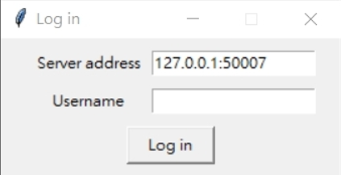
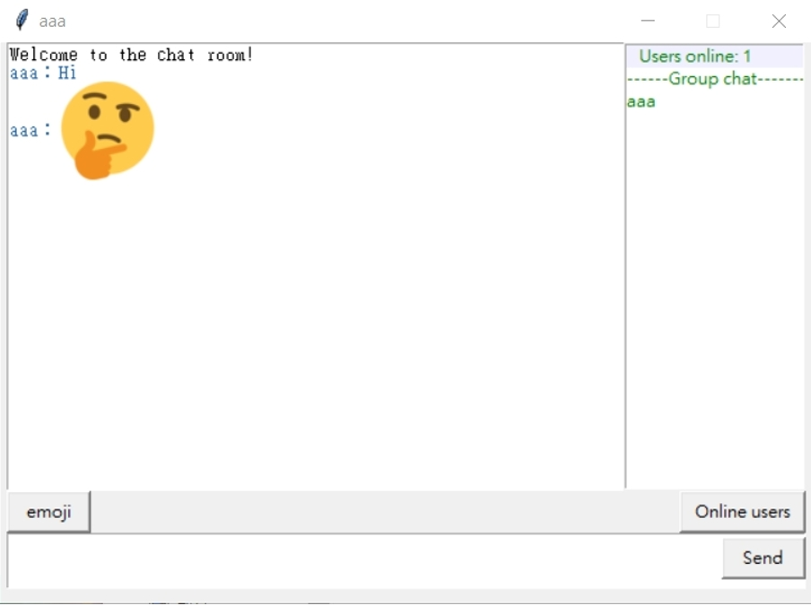
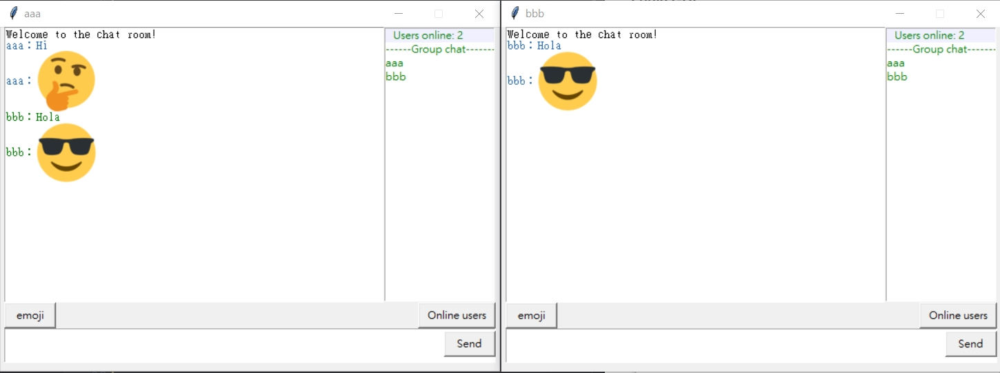
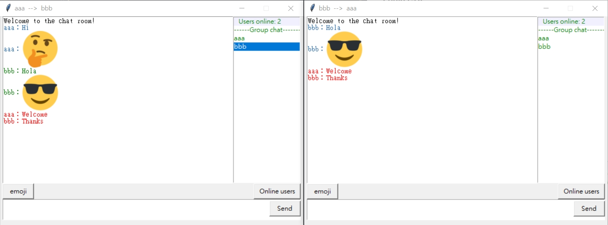

# python-chatroom
A Python TCP chatroom by Tkinter

## Usage

Activate chat server
```
python server.py
```

Activate chat client
```
python client.py
```


## Screenshots
### Login GUI, Input any username you want



### Chatroom GUI, support emoji


### Multi-client chat



### Private chat



# python_online_chat
